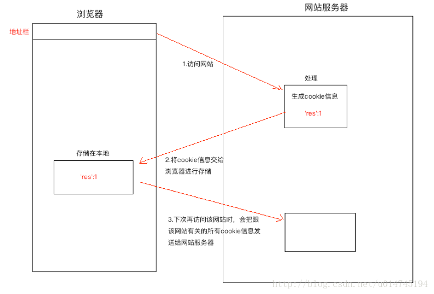
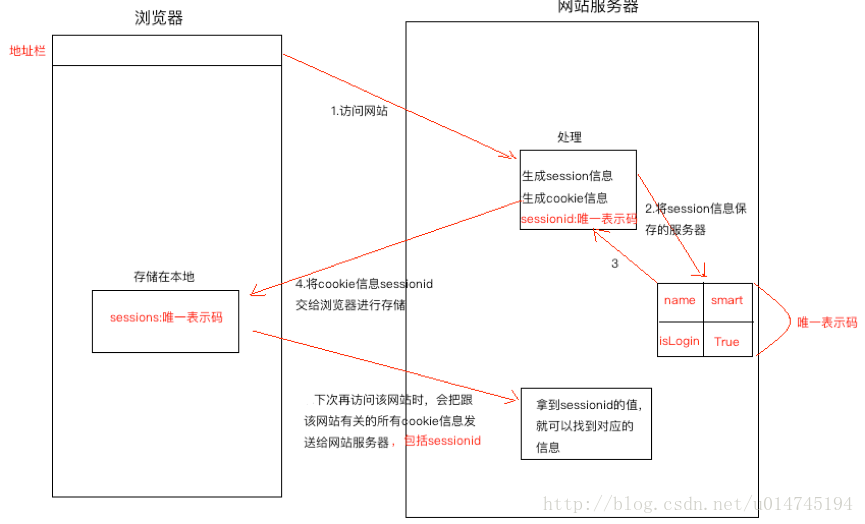

# 6 cookie和session

HTTP被设计为”无􏲃态”，也就是俗称“脸盲”。 这一次请求和下一次请求 之间没有任何􏲃状态保持，我们无法根据请求的任何方面(IP地址，用户代理等)来识别来自同一人的连续􏵎请求。实现状态保持的方式：在客户端或服务器端存储与会话有关的数据（客户端与服务器端的一次通信，就是一次会话）

- cookie
- session

不同的请求者之间不会共享这些数据，cookie和session与请求者一一对应。

## 一、cookie

cookies 是浏览器为 Web 服务器存􏸀的一小􏷠信息。 每次浏览器从某个服务器请求页面 时，都会自动带上以前收到的cookie。cookie保存在客户端，安全性较差，注意不要保存敏感信息。典型应用：

- 网站登录
- 购物车

用法：

~~~
# 1.设置cookie
HttpResponse.set_cookie(key, value='', max_age=None, expires=None, path='/', domain=None, secure=None, httponly=False)
参数：
	key：    cookie的名称(*)
	value:   cookie的值,默认是空字符
	max_age：cookies的持续有效时间（以秒计），如果设置为 None，cookies 在浏览器关闭的时候就失效了。
	expires：cookies的过期时间，格式:"Wdy, DD-Mth-YY HH:MM:SS GMT" 如果设置这个参数，它将覆盖max_age。
	path:    cookie生效的路径前缀，浏览器只会把cookie回传给带有该路径的页面，这样你可以避免将cookie传给
             站点中的其他的应用。/ 表示根路径，特殊的：根路径的cookie可以被任何url的页面访问
    domain:   cookie生效的站点。你可用这个参数来构造一个跨站cookie。如， domain=".example.com" 所构造的
              cookie对下面这些站点都是可 读的： www.example.com 、 www2.example.com。
              如果该参数设置为None，cookie只能由设置它的站点读取。
    secure:   如果设置为 True ，浏览器将通过HTTPS来回传cookie。
    httponly: 仅http传输   不能使用js获取cookie

#同set_cookie,不同点在于设置salt，即加盐，加密存储cookie数据
HttpResponse.set_signed_cookie(key, value, salt='', max_age=None, expires=None, path='/', domain=None, secure=None, httponly=False)
~~~

~~~
#2 获取cookie
HttpRequest.COOKIES.get(key)

#获取加“盐”的cookie
HttpRequest.get_signed_cookie(key, default=RAISE_ERROR, salt='', max_age=None)
~~~

~~~
# 3删除cookie 
HttpResponse.delete_cookie(key, path='/', domain=None)
~~~

## 二、session

cookie看似解决了HTTP（短连接、无状态）的会话保持问题，但把全部用户数据保存在客户端，存在安全隐患，

于是session出现了。我们可以 把关于用户的数据保存在服务端，在客户端cookie里加一个sessionID（随机字符串）。其**工作流程**：

(1)、当用户来访问服务端时,服务端会生成一个随机字符串；

(2)、当用户登录成功后 把 {sessionID :随机字符串} 组织成键值对加到cookie里发送给用户；

(3)、服务器以发送给客户端 cookie中的随机字符串做键，用户信息做值，保存用户信息；

(4)、再访问服务时客户端会带上sessionid，服务器根据sessionid来确认用户是否访问过网站

### 2.1 cookie和session的区别与联系

- 区别
  - session将数据存储与服务器端   cookie存储在客户端
  - cookie 存储在客户端，不安全，sess存储在服务器端，客户端只存sesseionid,安全
  - cookie在客户端存储值有大小的限制，大约几kb。session没有限制

- 联系
  - session 基于cookie

### 2.2 session配置

1. #### 首先在settings.py中有如下配置（系统默认），

~~~
INSTALLED_APPS = [
    'django.contrib.sessions',
]
MIDDLEWARE = [
    'django.contrib.sessions.middleware.SessionMiddleware',
]
~~~

2. 进行数据迁移，生成session使用的数据库表

### 2.3 session操作

- session设置

~~~
def doregister(request):
    username = request.POST.get('username')
    password = request.POST.get('password')
    email = request.POST.get('email')
    user = User()
    user.username = username
    user.password = md5(password.encode('utf8')).hexdigest()
    user.email = email
    user.save()
    # 设置session
    request.session['username'] = username
    return render(request,"common/notice.html",context={
        'code':1,
        'msg':'注册成功',
        'url':'three:index',
        'wait':3
    })
~~~

- session获取

~~~
def index(request):
    # session获取 
    username = request.session.get('username')
    return render(request,'three/index.html',context={'username':username})
~~~

- session删除
  - clear()    清空所有session  但是不会将session表中的数据删除

  - flush()    清空所有 并删除表中的数据 
  - logout()   退出登录 清除所有 并删除表中的数据
  - del req.session['key'] 删除某一个session的值

~~~
def logout(request):
    request.session.flush()
    return redirect(reverse("three:index"))
~~~

